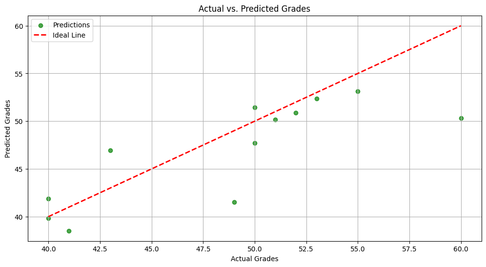

# Predicting-Student-Score-using-Simple-Linear-Regression
A simple problem for learning Linear Regression Implementation. Below is the graph showing the best fit line with the predicted and actual values plots.

# Features
- Data preprocessing and visualization.
- Implementation of Linear Regression through scikit-learn.
- Metrics used: MSE, MAE, R_2
- Visulization to observe errors and predictions
